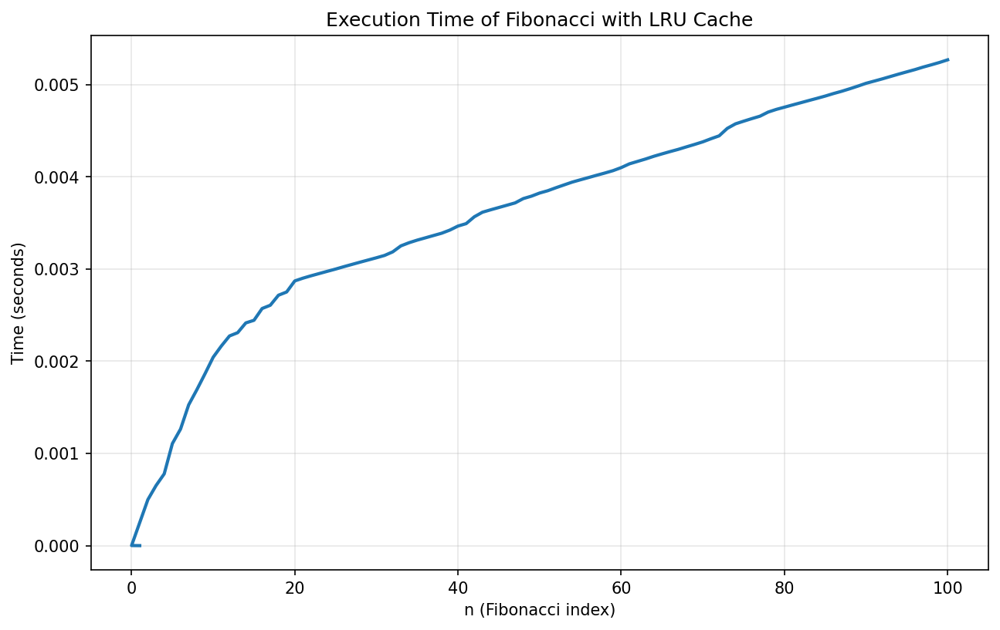

# CS3980
Topics in Computer Science I 


# Assignment 1: Python Refresher

## Echo Simulator

A Python program that simulates a real-world echo effect by progressively shortening the last word of your input.

### Files

- `echo.py` - Main program file containing the echo simulation logic

### How It Works

The `echo()` function creates an echo effect by:

1. Extracting the last word from your input text
2. Taking the last N characters of that word (where N is the repetition count, default is 6)
3. Progressively removing characters from the beginning, one at a time
4. Displaying each shortened version on a new line
5. Ending with a period to signify silence

### Usage

Run the program and enter your text when prompted:
```
Yell something at a mountain:
```

### Example

```python
>>> echo("Hello mountain", repetitions=8)
mountain
ountain
untain
ntain
tain
ain
in
n
.
```


## Fibonacci Calculator with Performance Analysis

### Overview
A Python program that calculates Fibonacci numbers using memoization and visualizes the execution time to demonstrate the power of caching in recursive algorithms.


### Files

- `fib.py` - Main program file containing the Fibonacci calculator with timing and visualization
- `fib.png` - Generated plot showing execution time vs Fibonacci index (created after running the program)

### How It Works

The program:

1. Calculates Fibonacci numbers recursively using an optimized cached approach
2. Measures execution time for each calculation using a custom timer decorator
3. Stores timing data in lists for analysis
4. Generates a visualization showing how execution time increases with n
5. Saves the plot as a high-quality PNG image

### The Fibonacci Sequence

The Fibonacci sequence is: 0, 1, 1, 2, 3, 5, 8, 13, 21, 34, ...

Where each number is the sum of the two preceding numbers:
```
F(0) = 0
F(1) = 1
F(n) = F(n-1) + F(n-2)
```

### Output

### Terminal Output
```
Finished in 0.00000120s: f(0) -> 0
Finished in 0.00000090s: f(1) -> 1
Finished in 0.00014150s: f(2) -> 1
Finished in 0.00000080s: f(3) -> 2
Finished in 0.00015290s: f(4) -> 3
Finished in 0.00000080s: f(5) -> 5
...
Finished in 0.00000180s: f(98) -> 135301852344706746049
Finished in 0.00000170s: f(99) -> 218922995834555169026
Finished in 0.00000210s: f(100) -> 354224848179261915075
```

### Generated Plot (`fib.png`)

The program generates a line graph showing:
- X-axis: Fibonacci index (n) from 0 to 100
- Y-axis: Execution time in seconds
- Pattern: Nearly linear growth showing O(n) complexity with caching



### Usage

Run the program:
```bash
python fib.py
```

This will:
1. Calculate Fibonacci numbers from F(0) to F(100)
2. Print timing information for each calculation
3. Save a plot as `fib.png` in the current directory

### Modifying the Range

To calculate different Fibonacci numbers, modify line 42:

```python
# Calculate up to F(50)
fib(50)

# Calculate up to F(200)
fib(200)
```